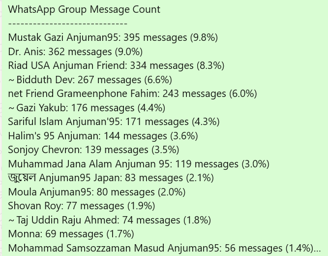

# WhatsAppChatAnalyzer
From Chat Logs to Chat Insights: Automate Your WhatsApp Analysis with Python! 

# WhatsApp Group Chat Analyzer

[](#requirements)  
[](./LICENSE)

A **lightweight**, **zero-dependency** Python script that parses any WhatsApp group-chat export and instantly produces:

- 🥇 **Message counts** per participant  
- 📊 **Percentage share** of total messages  
- 🔔 **“Dominant user” alerts** (anyone who sent >25% of the messages)

Perfect for community managers, educators, or anyone curious about engagement trends in their WhatsApp groups!

---

## 📸 Screenshot



---

## 🚀 Features

- **Automatic parsing** of standard WhatsApp `.txt` exports  
- **Pure-Python** (only uses the standard library)  
- **Easy to customize** regex pattern or dominance threshold  
- **Flags** users with disproportionate messaging volume  
- **Runs in seconds** on even large chat files  

---

## 🔧 Requirements

- Python **3.6** or higher  
- No third-party libraries required  

---

## 🛠️ Installation

1. **Clone** this repository  
   ```bash
   git clone https://github.com/shovanroyUSA/WhatsAppChatAnalyzer.git
 

